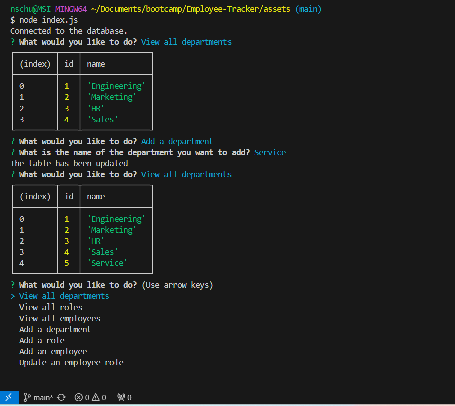

# Employee-Tracker

## Overview

This is a content management system, built to help employers track their employees, departments, and roles. Using the application, you can - view all departments, employees, and roles; add a department, employee, and role; and also update an employee role. 

## Built With

This application is built with node.js, inquirer, and MySQL.

## Installation

To install, clone the GitHub repo, npm i, node index.js

## License

MIT (https://choosealicense.com/licenses/mit/)

## Project Status & Future Development

This is a completed project, with no future developments in mind.

GitHub Repo: https://github.com/NicoleBrubaker/Employee-Tracker

Video Walkthrough: 

Screenshot of working app:

